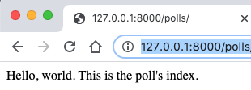

 # Django tutorial

### <a href = "https://docs.djangoproject.com/en/3.0/intro/tutorial01/"> Official Documentation </a>

#### Project Setup

1) Set up virtual environment

    ~~~ bash
    python3 -m venv tut_env
    ~~~

2) Launch virtual environment from VS Code terminal

    ~~~ bash
    source tut_env/bin/activate
    ~~~

    - entering `deactivate` will leave exit virtual environment 
3) Install `Django` 

    ~~~ bash
    pip install django
    ~~~

   - the version can be verified by running `python3 -m django --version`

4) Create Project within the virtual environment

    ~~~ bash
    django-admin startproject mysite
    ~~~

   - Change to the `mysite` directory and verify project is setup correctly by launching server `python manage.py runserver`
   - If you accidentally close the terminal in VS Code and need to quit the server, enter the following in a new terminal
       - `sudo kill $(lsof -t -i:8000)` 
5) Create the polls app within the `mysite` folder

    ~~~ bash
    python manage.py startapp polls
    ~~~

#### Set up first view

- A view function, or view for short, is a Python function that takes a Web request and returns a Web response  
- Each view is represented by a Python function (or method, in the case of class-based views)
- A URLconf maps URL patterns to views
- <a href = "https://docs.djangoproject.com/en/3.0/topics/http/views/" > See Writing Views for more info </a>
  
- The overall process flow is:
- Write `view` function inside the app's `views.py`
- Map the app view to a URL using a `URLconf` 
- Update the project's `root URLconf`
  
1) Add the following to `polls/views.py`
    ~~~ py
    from django.http import HttpResponse

    # Create your views here.
    def index(request):
        return HttpResponse("Hello, world. This is the poll's index.")
    ~~~
2) Create a `urls.py` in the the polls app and add the following:
  
    ~~~ py
    from django.urls import path

    from . import views

    urlpatterns = [
        path('', views.index, name = "index"),

    ]
    ~~~

3) Point the root URLconf in the project to the `polls.url` module 

   - inside `mysite/urls.py`, add the `path('polls/', include('polls.urls'))`

    ~~~ py
    urlpatterns = [
        path('polls/', include('polls.urls')),
        path('admin/', admin.site.urls),
    ]
    ~~~

4) Restart the server and goto `http://127.0.0.1:8000/polls/`

   - You should see the view in the browser

#### Set up Database

1) Create the database (SQLite by default):
    - `python manage.py migrate`

2) Create `Question` and `Choice` models

- Each model is  class that represents the `shape` of you app's data

    ~~~ py
    import datetime

    from django.db import models
    from django.utils import timezone

    # Create your models here.
    class Question(models.Model):
        question_text = models.CharField(max_length = 200)
        pub_date = models.DateTimeField('date published')

        def __str__(self):
            return self.question_text

        def was_published_recently(self):
            return self.pub_date >= timezone.now() - datetime.timedelta(days=1)    

    class Choice(models.Model):
        question = models.ForeignKey(Question, on_delete = models.CASCADE)
        choice_text = models.CharField(max_length = 200)
        votes = models.IntegerField(default = 0)    

        def __str__(self):
            return self.choice_text  
    ~~~

3) Update `mysite/settings.py`

   - in `polls/apps.py` the configuration class is defined 

    ~~~ py
    class PollsConfig(AppConfig):
        name = 'polls'
    ~~~

   - add the following line inside of `settings.py` to reference this configuration class
  
        ~~~ py
        INSTALLED_APPS = [
            'polls.apps.PollsConfig',
            'django.contrib.admin',
            'django.contrib.auth',
            'django.contrib.contenttypes',
            'django.contrib.sessions',
            'django.contrib.messages',
            'django.contrib.staticfiles',
        ]
        ~~~

4) Use `makemigrations` to let Django know that models were updated
    
    ~~~ bash
    python manage.py makemigrations polls
    ~~~

5) Migrate changes into database

    ~~~ bash
    python manage.py migrate
    ~~~

#### The overall flow is

- Create models in the app's `models.py`
- Create migrations using `python manage.py makemigrations`
- Run the migrations using `python manage.py migrate`

#### Create a superuser and access admin panel

1) Enter the following in the terminal

    ~~~ bash
    python manage.py createsuperuser
    ~~~

2) Modify the `polls/admin.py` file to allow admin access the poll app

    ~~~ py
    from .models import Question

    admin.site.register(Question)
    ~~~

3) Set the time zone in `settings.py` to current location 

    ~~~ py
    TIME_ZONE = 'America/Chicago'
    ~~~

4) Verify the admin panel functionality by logging in

   - `http://127.0.0.1:8000/admin`
   - selecting polls will allow access to data entered in python shell previously `python manage.py shell`
   - enter `quit()` to leave the shell
       - from polls.models import Choice, Question
       - from django.utils import timezone
       - q = Question(question_text="What's new?", pub_date=timezone.now())  
       - q.save()  

#### Create details, results, and vote views

The overall process flow is :
    - Write `view` function inside the app's `views.py`
    - Map the app view to a URL using a `URLconf`
    - Update the project's `root URLconf`

1) Add the following to `views.py`

    ~~~ py
    def detail(request, question_id):
        return HttpResponse(" You are looking at question %s. " % question_id)

    def results(request, question_id):
        response = "You are looking at the results of question %s. "
        return HttpResponse(response % question_id)

    def vote(request, question_id):
        return HttpResponse("You are voting on question %s." % question_id)
    ~~~  

2) Update the `urlpatterns` variable in `/polls/utls.py`

    ~~~ py
    urlpatterns = [
        path('', views.index, name = "index"),  #/polls/
        path('<int:question_id>/', views.detail, name = 'detail'), #/polls/4/
        path('<int:question_id>/results/', views.results, name = 'results'), #/polls/2/results/
        path('<int:question_id>/vite/', views.vote, name = 'vote'), #/polls/3/vote/

    ]
    ~~~

3) The `root URLconf` already points to the `polls.urls module` and does not need to be updated

4) Update the index view so that it uses a template

- the `render` function is a Django shortcut function that takes in:
  - request object
  - template name
  - context dictionary that passes info to the template 

<a href = "https://docs.djangoproject.com/en/3.0/topics/http/shortcuts/#django.shortcuts.render">see Django shortcut functions</a>

~~~ py
    def index(request):
        latest_question_list = Question.objects.order_by('pub_date')[:5]

        context = {'latest_question_list': latest_question_list}

        return render(request, 'polls/index.html', context)
~~~

#### Create a template for the index view inside the following directory structure `polls/templates/polls/index.html`

~~~ html
    
        <ul>
        
            <li><a href="/polls/{{ question.id }}/">{{ question.question_text }}</a></li>
        
        </ul>
    
        
No polls are available.

    
~~~

#### Update the detail view to use the `get_object_or_404` shortcut

1) Modify the `detail` view

    ~~~ py
    def detail(request, question_id):
        question = get_object_or_404(Question, pk = question_id)
        return render(request, 'polls/detail.html', {'question': question})
    ~~~

2) Create a template for detail

    ~~~ html
    <h1>> {{ question.question_text }} </h1>

    <ul>
        
            <li> {{ choice.choice_text }} </li>
        
    </ul>
    ~~~

3) Update the `index.html` template to use the `` template tag

    ~~~ html
        
            <li><a href="">{{ question.question_text }}</a></li>
         
    ~~~

4) Apply `Namespacing URLnames` to the URLconf

    add `app_name = 'polls'` to `polls/urls.py`

    ~~~ py
    app_name = 'polls'
    urlpatterns = [
        path('', views.index, name = "index"),  #/polls/
        path('<int:question_id>/', views.detail, name = 'detail'), #/polls/4/
        path('<int:question_id>/results/', views.results, name = 'results'), #/polls/2/results/
        path('<int:question_id>/vite/', views.vote, name = 'vote'), #/polls/3/vote/

    ]
    ~~~

5) The index template of question_text info and links to the detail template that shows choice_text will now be displayed at `http://127.0.0.1:8000/polls/`

#### Create form inside `detail.html` template

- `forloop.counter` tracks the number of iterations
- `method = "post"` uses the HTTP POST method to package and encode form data. It then sends it to the server and receives a response. Any changes to the system(e.g. database) should use the `POST method`.
- Since `GET` requests package data into a string and then create URL, it is less secure for more sensitive form information like usernames and passwords. It should only be used for requesting data. It is more practical for websearch forms since the URLs can be bookmarked, etc.

    ~~~ html
        <body>
            <h1> {{ question.question_text }} </h1>

            
                
<strong> {{error_messsage}} </strong>

            

            <form action = "" method = "post">
                
                
                    <input type = "radio" name = "choice" id = "choice{{forloop.counter}}" value = "{{choice.id}}">
                    <label for = "choice{{ forloop.counter}}">{{choice.choice_text}}</label>
                     
                

                <input type = "submit" value = "Vote">
            </form>

        </body>
    ~~~

#### Update the vote view

1) Add the following imports to `views.py` 

   - import HttpResponseRedirect

       ~~~ py
       from django.http import HttpResponse, HttpResponseRedirect
       ~~~

   - import `reverse`

       ~~~ py
       from django.urls import reverse
       ~~~

   - import the `Choice` model

       ~~~ py
       from .models import Question, Choice
       ~~~

2) Change the `vote` function as follows:

- `pk=request.POST['choice']` returns a string of the selected choice

    ~~~ py
    def vote(request, question_id):
        question = get_object_or_404(Question, pk=question_id)

        try:
            selected_choice = question.choice_set.get(pk=request.POST['choice'])
        except (KeyError, Choice.DoesNotExist):
            # redisplay question voting form
            return render(request, 'polls/detail.html',
                {
                    'question': question,
                    'error_message': "you did not make a choice",
                }
            )
        else:
            selected_choice.votes += 1
            selected_choice.save()
            # Return HttpResponseRedirect after a successful POST to prevent
            # data from being posted twice if user hits Back button
            return HttpResponseRedirect(reverse('polls:results', args=(question.id,)))
    ~~~

#### Update the results view & add results template

1) Modify the `results` view

    ~~~ py
    def results(request, question_id):
        question = get_object_or_404(Question, pk=question_id)
        context = {'question': question}
        return render(request, 'polls/results.html', context)
    ~~~

2) Create a `/polls/result.html` template

    ~~~ html
    <!doctype html>
    <html lang = "en">
        <head>
            <meta charset = "utf-8">
            <meta name = "viewport" content = "width=device-width",
                initial-scale=1,
                shrink-to-fit = "no"
            >

            <title> Django Tutorial </title>

        </head>

        <body>

            <h1> {{ question.question_text }} </h1>
            <ul>
            
                <li> {{ choice.choice_text }} -- {{choice.votes }}
                    vote{{ choice.votes|pluralize }}
                </li>
            
            </ul>

            <a href = "">  Vote again ? </a>
        </body>
    </html>
    ~~~

#### Implement Generic Views

1) Modify `polls/urls.py`

   - Original

    ~~~ py
    from django.urls import path

    from . import views

    urlpatterns = [
        path('', views.IndexView.as_view(), name = "index"),  #/polls/
        path('<int:pk>/', views.DetailView.as_view(), name = 'detail'), #/polls/4/
        path('<int:pk>/results/', views.ResultsView.as_view(), name = 'results'), #/polls/2/results/
        path('<int:question_id>/vite/', views.vote, name = 'vote'), #/polls/3/vote/
    ]
    ~~~

    - Modified

    ~~~ py

    from django.urls import path

    from . import views
    app_name = 'polls'
    urlpatterns = [
        path('', views.IndexView.as_view, name = "index"),  #/polls/
        path('<int:pk>/', views.DetailView.as_view, name = 'detail'), #/polls/4/
        path('<int:pk>/results/', views.ResultsView.as_view, name = 'results'), #/polls/2/results/
        path('<int:question_id>/vite/', views.vote, name = 'vote'), #/polls/3/vote/
    ]
    ~~~

2)  Modify views.py   (the `vote` view is not changed)

    - Original

    ~~~ py
    from django.shortcuts import render, get_object_or_404
    from django.http import HttpResponse, HttpResponseRedirect
    from django.urls import reverse

    from .models import Question, Choice
    # Create your views here.
    def index(request):
        latest_question_list = Question.objects.order_by('-pub_date')[:5]

        context = {'latest_question_list': latest_question_list}

        return render(request, 'polls/index.html', context)

    def detail(request, question_id):
        question = get_object_or_404(Question, pk = question_id)
        return render(request, 'polls/detail.html', {'question': question})

    def results(request, question_id):
        question = get_object_or_404(Question, pk=question_id)
        context = {'question': question}
        return render(request, 'polls/results.html', context)
    ...
    ~~~

- Modified
    - Notice we imported generic
    - `ListView` - a page representing a list of objects
    - `DetailView` displays a detail page for a specific type of object
    - `pk` is expected variable name

    ~~~ py
    from django.shortcuts import render, get_object_or_404
    from django.http import HttpResponse, HttpResponseRedirect
    from django.urls import reverse
    from django.views import generic

    from .models import Question, Choice
    # Create your views here.
    class IndexView(generic.ListView):
        template_name = 'polls/index.html'
        context_object_name = 'latest_question_list'

        def get_queryset(self):
            """ Return the last five unpublished questions """
            return Question.objects.order_by('-pub_date')[:5] 

    class DetailView(generic.DetailView):
        model = Question
        template_name = 'polls/detail.html'

    class ResultsView(generic.DetailView):
        model = Question
        template_name = 'polls/detail.html'
    ~~~

### Creating tests

1) Add the following to `polls/test.py`

    ~~~ py
    import datetime
    from django.utils import timezone
    from .models import Question

    from django.test import TestCase

    # Create your tests here.
    class QuestionModelTests(TestCase):
        def test_was_published_recently_with_future_question(self):
            """  
            was_published_recently() returns False for questions whose pub_date is in the future
            """
            time = timezone.now() + datetime.timedelta(days = 30)
            future_question = Question(pub_date=time)
            self.assertIs(future_question.was_published_recently(), False)
    ~~~

2) Running `python manage.py test polls` should return the following

- the current code incorrectly returns True
- the testcase expects False since the pub_date is not recent

    ~~~ bash
    Creating test database for alias 'default'...
    System check identified no issues (0 silenced).
    F
    ======================================================================
    FAIL: test_was_published_recently_with_future_question (polls.tests.QuestionModelTests)
    was_published_recently() returns False for questions whose pub_date is in the future
    ----------------------------------------------------------------------
    Traceback (most recent call last):
    File "/Users/skutz/Documents/GitHub/django_tut/mysite/polls/tests.py", line 16, in test_was_published_recently_with_future_question
        self.assertIs(future_question.was_published_recently(), False)
    AssertionError: True is not False

    ----------------------------------------------------------------------
    Ran 1 test in 0.001s

    FAILED (failures=1)
    Destroying test database for alias 'default'...
    ~~~

3) Update 'polls/models.py'

   - Original

    ~~~ py
    ...
        def was_published_recently(self):
            return self.pub_date >= timezone.now() - datetime.timedelta(days=1)
    ~~~

   - Modified

    ~~~ py
        def was_published_recently(self):
            now = timezone.now()
            day_ago = now - datetime.timedelta(days = 1)

            # same as day_ago <= self.pub_date and self.pub_date <= now
            return day_ago <= self.pub_date <= now

    ~~~

 4) Improving testing the `was_published_recently` method to verify questions that are within a day and just over a day
  
    ~~~ py
        def test_was_published_recently_with_old_question(self):
            """  
            was_published_recently() returns False for questions whose pub_date is older than 1 day
            """
            time = timezone.now() - datetime.timedelta(days = 1, seconds = 1)
            old_question = Question(pub_date=time)
            self.assertIs(old_question.was_published_recently(), False)

        def test_was_published_recently_with_recent_question(self):
            """  
            was_published_recently() returns True for questions whose pub_date is within the last day
            """
            time = timezone.now() - datetime.timedelta(hours = 23, minutes = 59, seconds = 59)
            recent_question = Question(pub_date = time)
            self.assertIs(recent_question.was_published_recently(), True)

    ~~~
#### Use Django Test Client
1) Within python shell enter the following :

    ~~~ bash
    from django.test.utils import setup_test_environment
    setup_test_environment()
    from django.test import Client
    client = Client()
    from django.urls import reverse
    ~~~

2) Verify responses

    ~~~ bash
    response = client.get(reverse('polls:index'))
    response.status_code
    ~~~

    - should respond with `200`

    ~~~ bash
    response.context['latest_question_list']
    ~~~

    - should respond with `<QuerySet [<Question: What's up?>]>`

3) Exit the shell

#### Updating the polls index view to filter out future dates

1) Add the timezone import to `polls/views.py`

    ~~~ py
    from django.utils import timezone
    ~~~

2) Modify the `get_queryset` method so that it returns a filtered view that is `less-than-or equal-to the current time`
   - original

   ~~~ py
   def get_queryset(self):
       """ Return the last five unpublished questions """
       return Question.objects.order_by('-pub_date')[:5] 
   ~~~

   - modified

    ~~~ py
    def get_queryset(self):
    """ Return the last five unpublished questions """
    return Question.objects.filter( pub_date__lte = timezone.now() ).order_by('-pub_date')[:5] 
    ~~~

    - notice that there are 2 underscores between `date` and `lte`

3) Launch server and add a question with a future date in admin panel

4) Goto the `http://127.0.0.1:8000/polls/` URL and verify that the future date question is not displayed

#### Writing tests for `questions`

1) Import `reverse` into `tests.py`

    ~~~ py
    from django.urls import reverse
    ~~~

2) Add additional tests

    ~~~ py
    class QuestionIndexViewTests(TestCase):
        def test_no_questions(self):
            """
            If no questions exist, an appropriate message is displayed.
            """
            response = self.client.get(reverse('polls:index'))
            self.assertEqual(response.status_code, 200)
            self.assertContains(response, "No polls are available")
            self.assertQuerysetEqual(response.context['latest_question_list'], [])

        def test_past_question(self):
            """
            Questions with a pub_date in the past are displayed on the
            index page.
            """
            create_question(question_text="Past question.", days=-30)
            response = self.client.get(reverse('polls:index'))
            self.assertQuerysetEqual(
                response.context['latest_question_list'],
                ['<Question: Past question.>']
            )

        def test_future_question(self):
            """
            Questions with a pub_date in the future aren't displayed on
            the index page.
            """
            create_question(question_text="Future question.", days=30)
            response = self.client.get(reverse('polls:index'))
            self.assertContains(response, "No polls are available.")
            self.assertQuerysetEqual(response.context['latest_question_list'], [])

        def test_future_question_and_past_question(self):
            """
            Even if both past and future questions exist, only past questions
            are displayed.
            """
            create_question(question_text="Past question.", days=-30)
            create_question(question_text="Future question.", days=30)
            response = self.client.get(reverse('polls:index'))
            self.assertQuerysetEqual(
                response.context['latest_question_list'],
                ['<Question: Past question.>']
            )

        def test_two_past_questions(self):
            """
            The questions index page may display multiple questions.
            """
            create_question(question_text="Past question 1.", days=-30)
            create_question(question_text="Past question 2.", days=-5)
            response = self.client.get(reverse('polls:index'))
            self.assertQuerysetEqual(
                response.context['latest_question_list'],
                ['<Question: Past question 2.>', '<Question: Past question 1.>']
            )

    class QuestionDetailViewTests(TestCase):
        def test_future_question(self):
            """
            The detail view of a question with a pub_date in the future otherwsie returns 404
            """
            future_question = create_question(question_text = 'Future question.', days = 5)
            url = reverse('polls:detail', args = (future_question.id))
            response = self.client.get(url)
            self.assertEqual(response.status_code, 404)

        def test_past_question(self):
            """
            The detail view of a question with a pub_date in the past displays the question's text
            """
            past_question = create_question(question_text = 'Past Question. ', days =- 5)
            url = reverse('polls:detail', args = (past_question.id,))
            response = self.client.get(url)
            self.assertContains(response, past_question.question.text)
    ~~~

3) Amend the `get_queryset` method

    ~~~ py
    return Question.objects.filter(pub_date__lte = timezone.now())
    ~~~

4) Experiment with tests to see what type of errors results from typos

   - For example, in the QuestionDetailViewTests(TestCase) `test_past_question`, the original code is

     ~~~ py
     url = reverse('polls:detail', args = (past_question.id,))
     ~~~

       - Introduce ERROR and look for clues in error message

       ~~~ py
       url = reverse('polls: detail', args = (past_question.id,))
       ~~~

       ~~~ bash
       django.urls.exceptions.NoReverseMatch: Reverse for ' detail' not found. ' detail' is not a valid view function or pattern name.
       ~~~

       - Another ERROR experiment

       ~~~ py
       url = reverse('polls:detail', args = (past_question.id))
       ~~~

       ~~~ bash
       TypeError: _reverse_with_prefix() argument after * must be an iterable, not int
       ~~~

### Adding Basic Styling

1) Create a directory structure and style sheet inside `polls/static/polls/style.css`

2) Add the following to `style.css`

    ~~~ css

    li a {
        color: green;
    }

    body {
        background: blue url("images/background.png") no-repeat;
    }

    h1 {
        color: deeppink;
    }

    a {
        text-decoration: none;
    }

    ul li span{
        color: dodgerblue;
    }

    ~~~

3) Modify the template files to include the stylesheet

    ~~~ html

    
    <link rel = "stylesheet" type = "text/css" href = "">

    ~~~

4) Modify the `results.html` template to show different coloring on votes

~~~ html
    <li> {{ choice.choice_text }} -- 
         {{choice.votes}} vote{{ choice.votes|pluralize }} 
    </li>
~~~

#### Customize Admin Panel

- the `TabularInline` displays all fields for `Choice` objects

1. Use `fieldsets` to separate info in `admin.py`

    ~~~ py
    from django.contrib import admin

    # Register your models here.
    from .models import Choice, Question

    class ChoiceInline(admin.TabularInline):
        model = Choice
        extra = 3

    class QuestionAdmin(admin.ModelAdmin):
        fieldsets = [
            ('Question Text Field',  {'fields': ['question_text']}),
            ('Date information', {'fields':['pub_date'], 'classes': ['collapse']}),
        ]

        inlines = [ChoiceInline]

        list_display = ('question_text', 'pub_date', 'was_published_recently')

    admin.site.register(Question, QuestionAdmin)  
    ~~~